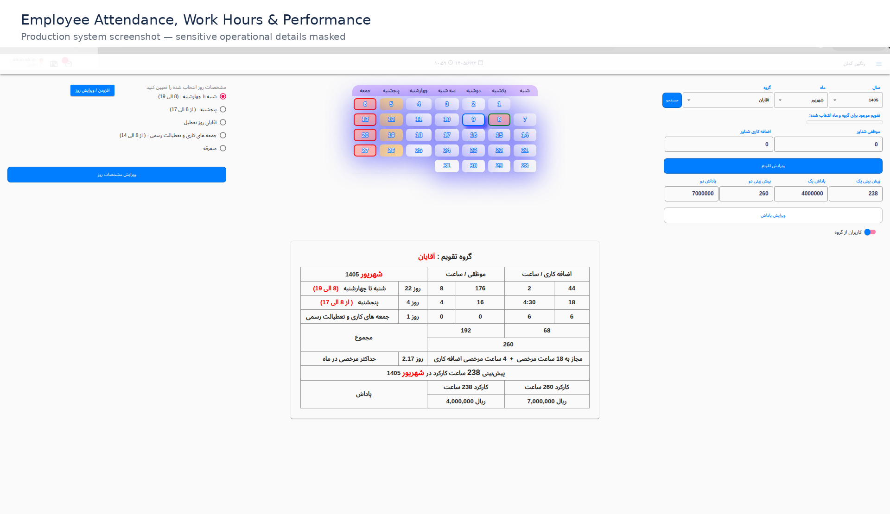
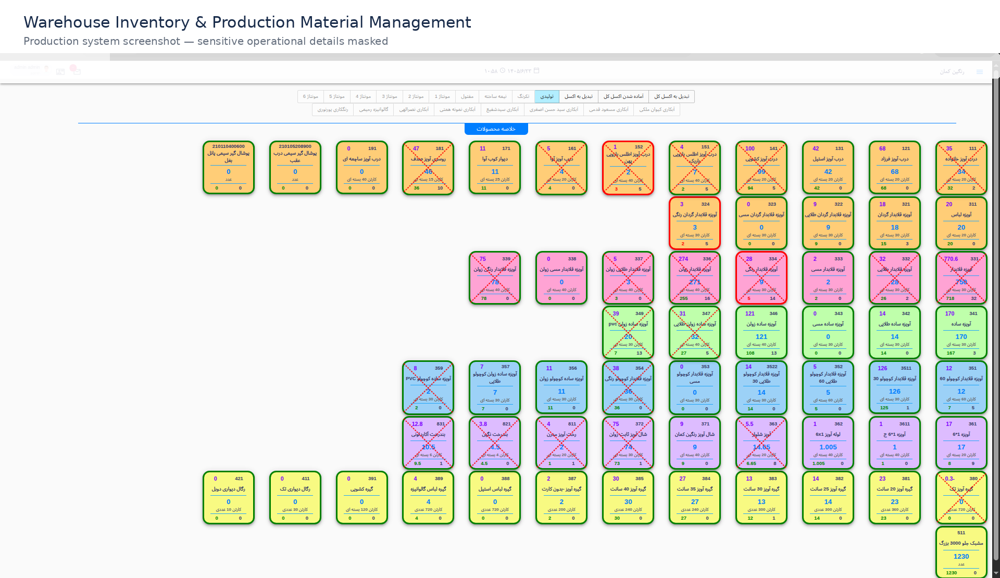
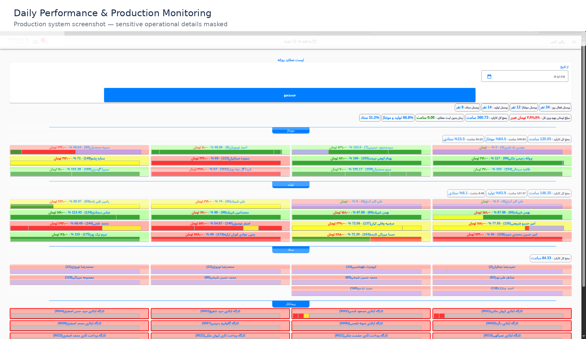

# Manufacturing Operations Management System

A custom internal management platform designed to connect manufacturing, employee operations, production, inventory, sales, attendance, and accounting-related workflows in one integrated system.

> Portfolio demonstration based on professional experience. No proprietary source code, company data, credentials, or confidential information is included.

---

## Overview

Manufacturing organizations often operate across multiple disconnected processes and systems.

This project demonstrates how those processes can be modeled and connected through a centralized business application.

The platform covers workflows such as:

- Employee operations
- Attendance and daily records
- Production workflows
- Inventory management
- Sales and order processes
- Worker performance and payment-related calculations
- Role-based access control
- External system integrations
- Operational reporting and data management

The goal is to reduce fragmented workflows and provide a consistent operational data flow across the organization.

---

## Business Problem

The organization needed a unified internal system capable of connecting different operational departments and processes.

Important business activities could involve multiple systems, manual processes, or disconnected data.

The system was designed around the actual business workflow rather than around isolated technical features.

---

## Solution

The platform provides a centralized application where operational data moves through connected business workflows.

A simplified process looks like:

**Employee → Attendance → Daily Activity → Production → Finished Product → Inventory → Sales → Accounting**

This approach allows different parts of the organization to work with consistent operational data.

---

## Key Features

### Employee & Attendance

- Employee records
- Attendance tracking
- Daily operational records
- Performance-related data
- Calendar-based calculations

### Production

- Production workflow management
- Daily production activities
- Finished product registration
- Production-related data tracking

### Inventory

- Inventory management
- Product movement
- Automatic inventory-related updates
- Connection between production and inventory

### Sales

- Sales workflow
- Order processing
- Product availability
- Inventory impact

### Authentication & Authorization

- User authentication
- Role-based access control
- Permission management
- Access restrictions by user role

### Integrations

The production system was designed to communicate with external services, including:

- Accounting software
- Attendance / fingerprint systems
- SMS services
- External APIs

---

---

## Screenshots

### Employee Operations

### Warehouse & Inventory

### Daily Performance

---

## My Role

### System Analysis & Technical Coordination

Worked with management and the development team to understand business processes, analyze operational workflows, and translate requirements into system functionality.

### Frontend Development

Led the React frontend implementation and translated business workflows into practical user interfaces.

### Backend & Integration

Contributed to Django backend development and worked on integrations with accounting, attendance, and SMS systems.

### Deployment & Technical Delivery

Handled deployment, infrastructure-related tasks, and technical coordination across the project lifecycle.

---

## Technology Stack

### Frontend

- React
- JavaScript
- TypeScript

### Backend

- Django
- Python
- Node.js

### Database

- PostgreSQL
- MongoDB

### Infrastructure

- Linux
- Docker
- Nginx
- REST APIs

---

## Architecture

A simplified architecture of the system:

**React Frontend → REST API → Django Backend → PostgreSQL**

The backend also communicates with external systems such as:

- Accounting System
- Attendance / Fingerprint System
- SMS Service
- External APIs

---

## Business Workflow

**Employee → Attendance → Daily Activity → Production → Finished Product → Inventory → Sales → Accounting**

The important aspect of the system is not only the individual modules, but how business data moves between them.

---

## Engineering Focus

This project demonstrates experience in:

- Business process analysis
- Workflow modeling
- Full-stack application development
- React application architecture
- Django REST APIs
- Database design
- Authentication and authorization
- Role and permission management
- Third-party API integration
- Production deployment
- Internal business software development

---

## Portfolio Note

This repository is a public portfolio demonstration.

The original production system was developed for a real organization. Because the original application contains proprietary business logic and data, this repository does not contain the production source code.

The purpose of this project is to demonstrate the architecture, engineering approach, business workflow understanding, and technical responsibilities involved in building the system.

---

## Author

**Hossein Jan**

Senior Full-Stack Software Engineer | Technical Project Lead

🌐 Portfolio:  
https://hosseinjan128.github.io/

📧 Email:  
hosseinjan.sh@gmail.com

📍 Tehran / Pardis, Iran

---

## Related

- [Portfolio Website](https://hosseinjan128.github.io/)
- [GitHub Profile](https://github.com/HosseinJan128)
